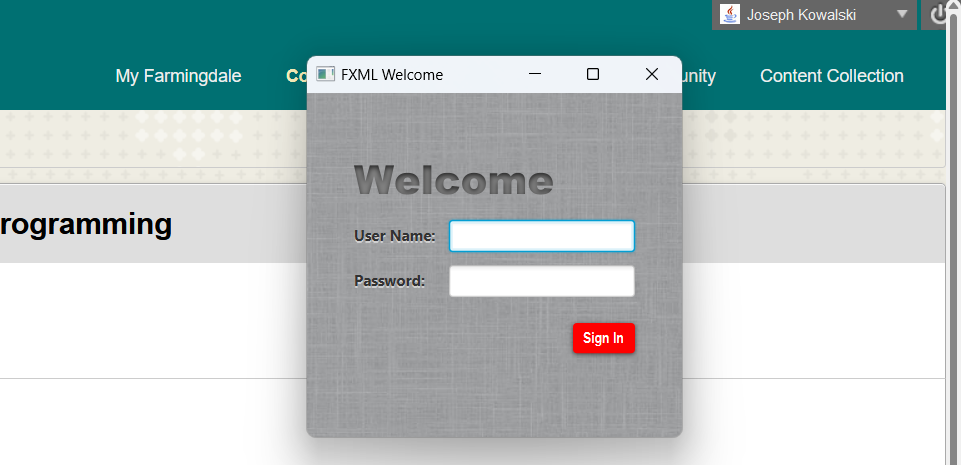
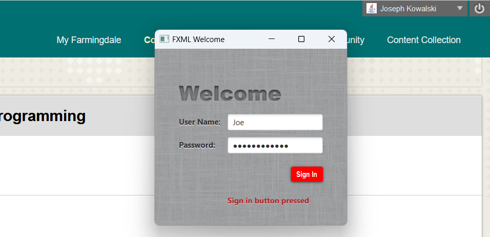

# FXMLExample

This is a program written in Netbeans using FXML. It generates a user interface created from instructions posted in a tutorial on the Oracle website.

The link for this tutorial can be found here:  [https://docs.oracle.com/javafx/2/get_started/fxml_tutorial.htm](https://docs.oracle.com/javafx/2/get_started/fxml_tutorial.htm)

## Screenshots

Without info or button pressed:

With info and button pressed:

